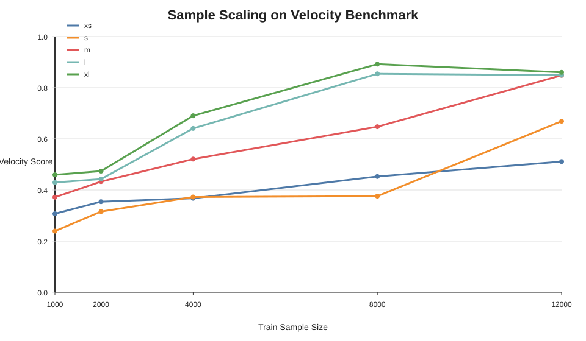
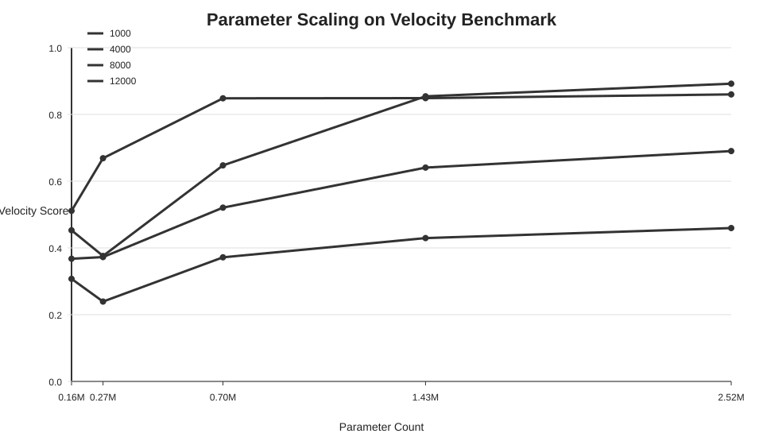
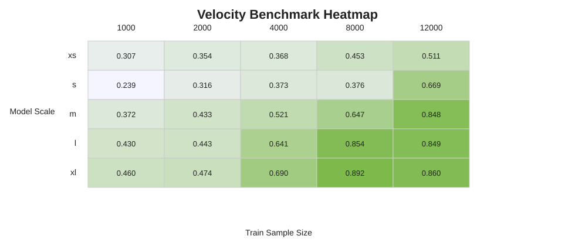

# Scaling 实验报告

## 1. 结论摘要

这轮 5x5 实验验证了两件事：

1. 扩大样本量会明显提升 velocity benchmark 效果。
2. 在样本量足够大时，扩大模型参数量也会明显提升效果。

当前 25 组里最好的配置是：

- `run_name=scale_xl_n8000`，参数量 `2519836`，`overall_velocity_score=0.8921`，`count_exact_mean=0.9483`，`amount_bucket_accuracy=0.7969`

count 类 velocity 最强配置：

- `scale_xl_n8000`，`count_exact_mean=0.9483`

amount 累加类 velocity 最强配置：

- `scale_l_n12000`，`amount_bucket_accuracy=0.8062`

## 2. 图表

## 3. 观察

### 3.1 Sample Scaling

固定模型规模时，样本量增加总体会带来更好的 velocity 预测效果。

- `xs`: 1000->0.307, 2000->0.354, 4000->0.368, 8000->0.453, 12000->0.511
- `s`: 1000->0.239, 2000->0.316, 4000->0.373, 8000->0.376, 12000->0.669
- `m`: 1000->0.372, 2000->0.433, 4000->0.521, 8000->0.647, 12000->0.848
- `l`: 1000->0.430, 2000->0.443, 4000->0.641, 8000->0.854, 12000->0.849
- `xl`: 1000->0.460, 2000->0.474, 4000->0.690, 8000->0.892, 12000->0.860

可以看到：

- `m/l/xl` 这几档模型在大样本区间提升最明显
- `xs/s` 在小样本区间波动较大，容量和优化噪声更明显
- amount 类目标通常比 count 类更依赖大样本

### 3.2 Parameter Scaling

固定样本量时，模型参数量扩大在中高样本区间基本也会带来收益。

- `train_size=1000`: xs->0.307, s->0.239, m->0.372, l->0.430, xl->0.460
- `train_size=2000`: xs->0.354, s->0.316, m->0.433, l->0.443, xl->0.474
- `train_size=4000`: xs->0.368, s->0.373, m->0.521, l->0.641, xl->0.690
- `train_size=8000`: xs->0.453, s->0.376, m->0.647, l->0.854, xl->0.892
- `train_size=12000`: xs->0.511, s->0.669, m->0.848, l->0.849, xl->0.860

更具体地看：

- 在 `1000/2000` 这种小样本区间，模型变大有收益，但不稳定
- 到了 `4000/8000/12000` 以后，`m/l/xl` 的优势开始明显放大
- 说明当前 benchmark 上，参数扩展需要足够数据支撑才能稳定兑现

### 3.3 Count vs Amount

count / distinct-count 类原子目标比 amount-sum 更容易学。

- `count_exact_mean` 的最好结果已经接近 `0.95`
- `amount_bucket_accuracy` 的最好结果接近 `0.80`，仍明显落后于 count 类

这说明：

- 模型对离散计数型 velocity 已经具备较强学习能力
- 对连续累加型 velocity，仍需要更多数据、参数或更直接的归纳偏置

## 4. 每个样本量下的最优配置

| train_size | best_run | params | overall_score | count_exact_mean | amount_bucket_acc |
|---|---|---:|---:|---:|---:|
| 1000 | scale_xl_n1000 | 2519836 | 0.4596 | 0.5196 | 0.1275 |
| 2000 | scale_xl_n2000 | 2519836 | 0.4738 | 0.5167 | 0.1388 |
| 4000 | scale_xl_n4000 | 2519836 | 0.6902 | 0.7017 | 0.4800 |
| 8000 | scale_xl_n8000 | 2519836 | 0.8921 | 0.9483 | 0.7969 |
| 12000 | scale_xl_n12000 | 2519836 | 0.8600 | 0.9394 | 0.7250 |

## 5. 每个模型规模下的最优配置

| scale | best_run | train_size | overall_score | count_exact_mean | amount_bucket_acc |
|---|---|---:|---:|---:|---:|
| xs | scale_xs_n12000 | 12000 | 0.5112 | 0.6342 | 0.0944 |
| s | scale_s_n12000 | 12000 | 0.6687 | 0.7938 | 0.3288 |
| m | scale_m_n12000 | 12000 | 0.8485 | 0.9123 | 0.7063 |
| l | scale_l_n8000 | 8000 | 0.8542 | 0.9135 | 0.7325 |
| xl | scale_xl_n8000 | 8000 | 0.8921 | 0.9483 | 0.7969 |

## 6. 结论

基于这 25 组结果，可以给出当前阶段的判断：

1. 在当前 synthetic velocity benchmark 上，sample scaling 明确成立。
2. parameter scaling 也成立，但在中高样本区间更明显。
3. 当前最强配置已经让 velocity benchmark 接近很强水平，但还不能直接外推到真实业务。
4. 下一步最值得做的是把同一套 scaling 验证迁移到真实离线样本上。
