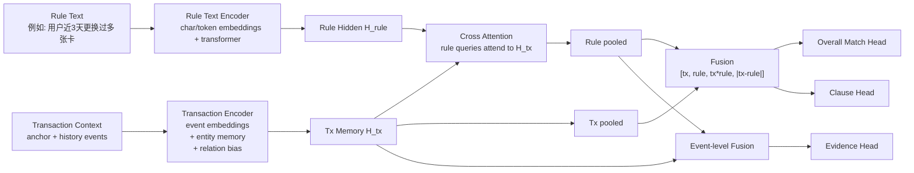

# 文本规则验证器架构与 Evidence 标注说明

## 1. 目的

本文档记录当前代码库中 `text rule verifier` 原型的两部分内容：

1. 模型架构具体是什么样的
2. `evidence_event_indices` 在 synthetic 数据里是如何生成的，以及真实业务样本中应如何构造

这份文档聚焦“当前实现”和“后续落地建议”，不替代整体方案文档。

相关代码位置：

- 交易编码器：`src/payment_foundation_model/model.py`
- verifier 模型：`src/payment_foundation_model/model.py`
- synthetic verifier 数据：`src/payment_foundation_model/synthetic_data.py`
- verifier 训练脚本：`scripts/train_rule_verifier.py`

---

## 2. 一句话定义

当前 `text rule verifier` 不是把交易改写成一段文本再喂给 LLM，而是：

1. 用 `Transaction Transformer` 编码结构化交易上下文
2. 用一个轻量文本编码器编码规则文本
3. 让规则文本去 cross-attend 交易表示
4. 输出：
   - 整体是否匹配 `overall_match`
   - 每个 clause 是否匹配 `clause_scores`
   - 哪些事件是证据 `evidence_event_indices`

它更接近：

- 一个 `transaction context + rule text` 的 cross-encoder verifier

而不是：

- 纯向量相似度模型
- 纯生成式 LLM
- 纯 tabular 二分类模型

---

## 3. 总体结构图



---

## 4. 交易侧编码器

交易侧主干是 `TransactionTransformer`，定义在：

- `src/payment_foundation_model/model.py`

### 4.1 输入形式

每个 event token 由以下部分组成：

1. 高基数局部实体 ID embedding
   - `user_local_id`
   - `card_local_id`
   - `device_local_id`
   - `email_local_id`
   - `address_local_id`
   - `ip_local_id`

2. 低基数类别 embedding
   - `domain_id`
   - `card_country_id`
   - `issuer_id`
   - `item_category_id`

3. 数值特征
   - `amount_log`
   - `delta_hours_log`

4. 与 anchor 的关系特征
   - `is_anchor`
   - `same_user_as_anchor`
   - `same_card_as_anchor`
   - `same_device_as_anchor`
   - `same_email_as_anchor`
   - `same_address_as_anchor`
   - `same_ip_as_anchor`
   - `has_device`
   - `has_email`
   - `has_address`
   - `has_ip`

对应代码逻辑：

- `TransactionTransformer._build_event_tokens`

### 4.2 事件 token 伪代码

```python
event_token = concat(
    user_emb(user_local_id),
    card_emb(card_local_id),
    device_emb(device_local_id),
    email_emb(email_local_id),
    address_emb(address_local_id),
    ip_emb(ip_local_id),
    domain_emb(domain_id),
    country_emb(card_country_id),
    issuer_emb(issuer_id),
    item_emb(item_category_id),
    [amount_log, delta_hours_log],
    relation_flags_to_anchor,
)

event_token = input_proj(event_token)
event_token = event_token + position_embedding
```

---

## 5. Entity Memory

如果开启 `use_entity_memory`，模型会为每类实体生成 memory token。

例如：

- 某张卡在上下文中出现了多次
- 就把这些事件 token 聚合成一个 `card memory token`

作用：

- 显式给模型提供“这张卡/这台设备/这个邮箱”的局部摘要
- 降低模型纯靠 attention 自己聚合统计量的难度

### 5.1 直觉图

```text
events using card_2   -> aggregate -> card_memory_2
events using device_1 -> aggregate -> device_memory_1
events using email_3  -> aggregate -> email_memory_3
```

### 5.2 伪代码

```python
for entity_type in [user, card, device, email, address, ip]:
    group events by local_id
    memory_token = mean(event_tokens in this group)
    memory_token += entity_type_embedding
    memory_token = entity_memory_proj(memory_token)
```

对应代码：

- `TransactionTransformer._build_entity_memories`

---

## 6. Typed Attention Bias

如果开启 `use_relation_bias`，模型会在 self-attention 中加入关系偏置。

当前支持的关系包括：

1. same user
2. same card
3. same device
4. same email
5. same address
6. same ip
7. recent time

作用：

- 强化“同卡连续尝试”“一机多卡”“同邮箱换卡”等关键关系
- 让模型更容易学习支付风控里常见的互累模式

### 6.1 伪代码

```python
attention_score =
    QK^T
    + relation_bias(same_card, same_device, ...)
    + memory_link_bias
```

对应代码：

- `TransactionTransformer._build_relation_bias`

---

## 7. 交易编码器输出

交易侧最终输出 3 个东西：

1. `memory`
   - 完整编码序列
   - 包含 `CLS + event tokens + entity memory tokens`

2. `memory_mask`
   - 哪些 token 是有效的

3. `tx_pooled`
   - `CLS` 位置的 pooled 表示
   - 用于整体判断

伪代码：

```python
x = concat([CLS, event_tokens, entity_memory_tokens])
encoded = relation_aware_encoder(x)
tx_pooled = encoded[:, 0]
return encoded, valid_mask, tx_pooled
```

对应代码：

- `TransactionTransformer.encode_events`

---

## 8. 文本侧编码器

当前原型中的文本侧是一个轻量实现，不是预训练大语言模型。

流程如下：

1. 使用字符级 tokenizer
2. 把规则文本编码成 `rule_input_ids`
3. 过一个小型 `TransformerEncoder`
4. 对文本 token 做 masked mean pooling

### 8.1 伪代码

```python
rule_ids = char_tokenizer(rule_text)
rule_hidden = rule_token_emb(rule_ids) + rule_position_emb
rule_hidden = rule_encoder(rule_hidden)
rule_pooled = masked_mean(rule_hidden)
```

对应代码：

- tokenizer: `scripts/train_rule_verifier.py`
- 文本编码：`TransactionRuleVerifier.encode_rule_text`

这部分现在只是为了把 verifier 流程跑通。后续如果正式做语言对齐，应替换成更强的 text encoder。

---

## 9. 交易和文本如何交互

这是 verifier 的核心。

当前实现方式：

1. 先得到交易表示 `H_tx`
2. 再得到规则表示 `H_rule`
3. 让规则 token 作为 query，对交易 memory 做 cross attention

### 9.1 公式

```text
H_tx   = TxEncoder(context)
H_rule = RuleEncoder(rule_text)

H_rule_cross = CrossAttention(
    query = H_rule,
    key   = H_tx,
    value = H_tx
)
```

这样规则文本中的短语就可以去“看”交易上下文中和自己有关的事件。

例如：

- “近3天更换过多张卡” 会关注 card 切换相关事件
- “账单身份近期变化” 会关注 email/address 漂移事件
- “近1天高频高额交易” 会关注近 1 天金额高的事件

对应代码：

- `TransactionRuleVerifier.forward`

---

## 10. 输出头

当前 verifier 有 3 类主要输出。

### 10.1 Overall Match

整体是否匹配：

```python
fused = concat(
    tx_pooled,
    rule_pooled,
    tx_pooled * rule_pooled,
    abs(tx_pooled - rule_pooled),
)
match_logit = match_head(fused)
```

### 10.2 Clause Head

对每个 clause 给一个 logit：

```python
clause_logits = clause_head(fused)
```

### 10.3 Evidence Head

对每个 event token 再和 `rule_pooled` 做 event-level 融合：

```python
event_fused_i = concat(
    event_repr_i,
    rule_pooled,
    event_repr_i * rule_pooled,
    abs(event_repr_i - rule_pooled),
)
evidence_logit_i = evidence_head(event_fused_i)
```

作用是给出：

- 哪些 event 最像这条规则的证据

---

## 11. 整体 forward 伪代码

```python
def forward(batch):
    # 1. encode transaction context
    H_tx, tx_mask, tx_pooled = tx_encoder.encode_events(batch)

    # 2. encode rule text
    H_rule, _ = encode_rule_text(
        batch["rule_input_ids"],
        batch["rule_attention_mask"],
    )

    # 3. rule attends to transaction memory
    H_rule_cross = cross_attention(
        query=H_rule,
        key=H_tx,
        value=H_tx,
        key_padding_mask=~tx_mask,
    )
    H_rule = layer_norm(H_rule + H_rule_cross)
    rule_pooled = masked_mean(H_rule, batch["rule_attention_mask"])

    # 4. overall match / clause
    fused = concat(
        tx_pooled,
        rule_pooled,
        tx_pooled * rule_pooled,
        abs(tx_pooled - rule_pooled),
    )
    match_logit = match_head(fused)
    clause_logits = clause_head(fused)
    uncertainty_logit = uncertainty_head(fused)

    # 5. event-level evidence
    event_repr = H_tx[:, 1:1+num_events]
    rule_expand = repeat(rule_pooled, num_events)
    event_fused = concat(
        event_repr,
        rule_expand,
        event_repr * rule_expand,
        abs(event_repr - rule_expand),
    )
    evidence_logits = evidence_head(event_fused)

    return {
        "match_logit": match_logit,
        "clause_logits": clause_logits,
        "uncertainty_logit": uncertainty_logit,
        "evidence_logits": evidence_logits,
    }
```

---

## 12. 当前训练目标

当前训练脚本使用的 loss 为：

```text
L =
  1.00 * overall_match_loss
  + 0.50 * clause_loss
  + 0.20 * evidence_loss
  + 0.05 * uncertainty_loss
```

其中：

- `overall_match_loss`
  - 整条规则是否满足
- `clause_loss`
  - 各 clause 的真假
- `evidence_loss`
  - 哪些 event 是证据
- `uncertainty_loss`
  - 预留给未来真实模糊规则

此外还对 `overall_match` 使用了 `pos_weight`，因为正样本比负样本少。

对应代码：

- `scripts/train_rule_verifier.py`

---

## 13. synthetic 数据中的 evidence_event_indices 是怎么打的

当前 synthetic 中，`evidence_event_indices` 不是人工 gold label，而是程序化生成的 `silver evidence`。

更准确地说：

- clause 的真假先由程序计算
- evidence 再由规则执行逻辑返回一个 supporting events 集合

对应代码：

- `_compute_verifier_features`
- `_build_rule_pair_rows`

### 13.1 关键点

当前 synthetic evidence 的本质是：

- `programmatic witness`
- 不是最终意义上的最小、最干净的人工解释标签

它的优点：

- 成本低
- 可规模化
- 适合训练 early-stage verifier

它的缺点：

- 通常不是最小证据集
- 可能包含冗余事件
- 目前只有 event 级，没有 field / entity 级证据

---

## 14. synthetic 中各 clause 的 evidence 规则

下面是当前实现中几类典型 clause 的 evidence 打法。

### 14.1 `recent_multi_card_3d_ge_2`

代码逻辑：

```python
evidence = all events in recent_3d window
```

含义：

- 把近 3 天窗口内的相关事件都当作支持“近 3 天换卡”的候选证据

不足：

- 这不是最小证据集
- 更严格的话，应该只保留能覆盖至少两张不同卡的代表事件

### 14.2 `same_device_multi_card_7d_ge_3`

代码逻辑：

```python
evidence = all recent_7d events whose device_id == anchor.device_id
```

含义：

- 把同设备的那些事件都贴成证据

不足：

- 也偏宽松
- 更严格的话应该只保留足以证明“同设备关联 >= 3 张卡”的最小事件集合

### 14.3 `billing_profile_changed_7d`

代码逻辑：

```python
evidence = events whose email/address differs from anchor
```

这个相对合理，因为这些事件本身就是“账单身份变化”的直接证明。

### 14.4 `anchor_new_card / anchor_new_device / anchor_new_email_or_address`

代码逻辑：

```python
evidence = [anchor]
```

因为这类 clause 的关键事实发生在当笔本身：

- 当前卡是否新
- 当前设备是否新
- 当前账单身份是否新

### 14.5 `high_freq_high_amount_1d`

代码逻辑：

```python
evidence = high amount events in recent_1d + anchor
```

这也是宽松证据，而不是最小 witness。

---

## 15. synthetic 中 overall evidence 怎么得到

一条 rule 通常由多个 clause 组成。

当前代码中做法是：

1. 先给每个 clause 生成自己的 evidence
2. 再把所有 clause 的 evidence 做并集

伪代码：

```python
evidence_indices = union(
    evidence_map[clause_1],
    evidence_map[clause_2],
    ...
)
```

然后存到：

- `labels.evidence_event_indices`

对应代码：

- `_build_rule_pair_rows`

这意味着当前的 evidence 还是“整条 rule 的 overall evidence”，还不是“按 clause 分开的 evidence”。

---

## 16. 真实业务样本里 evidence_event_indices 应该怎么来

真实业务里不应该完全照搬 synthetic 的这套简化方式。

建议把真实 evidence 分成 4 个层级。

### 16.1 Level 1：规则 / 特征引擎直接返回 provenance

这是最推荐的。

如果规则文本最终能解析成结构化 clause IR，例如：

```json
{
  "logic": "AND",
  "clauses": [
    {
      "type": "distinct_card_count",
      "window": "3d",
      "op": ">=",
      "value": 2
    },
    {
      "type": "billing_profile_changed",
      "window": "7d"
    }
  ]
}
```

那么规则执行时就不应只返回“命中/不命中”，还应返回：

- 计算值
- supporting event ids
- supporting entities
- supporting anchor fields

例如：

```json
{
  "clause_id": "c1",
  "value": 3,
  "matched_event_ids": ["e17", "e22", "e29"],
  "matched_entities": ["card_2", "card_5", "card_8"]
}
```

这就是最理想的真实 evidence 标签来源。

### 16.2 Level 2：离线 witness extraction

如果现有规则引擎拿不到 provenance，可以离线从 raw context 中做 witness extraction。

例如：

- `近 3 天 distinct card >= 2`

最小证据集可以是：

- 两张不同卡首次出现对应的两笔事件

这个比 synthetic 的“整个窗口都算证据”更干净。

### 16.3 Level 3：分析师人工 gold evidence

对于复杂模式，例如：

- 疑似躲闪
- 疑似团伙
- 疑似旅行而非盗刷

可以抽一小批样本让分析师标：

- 哪几笔历史交易是关键证据
- 哪个 clause 依赖哪些事件

这批数据量不需要大，但价值很高，可用于：

- 校准 programmatic evidence
- 构建高质量验证集
- 蒸馏到大规模弱监督数据

### 16.4 Level 4：没有 event 级 evidence 时的弱监督

如果真实业务里只有：

- `overall_match`
- `clause_labels`

没有 event 级 gold evidence，那么不要强行硬标。

可以：

1. 不训练 evidence head
2. 或者把 evidence 当 latent variable，用弱监督方法训练

例如：

- multiple instance learning
- weak top-k event selection

---

## 17. 真实业务里不应只保存 evidence_event_indices

当前原型里只有：

- `evidence_event_indices`

但真实业务更合理的协议应该包含三类证据：

1. `event_ids`
2. `entity_keys`
3. `anchor_fields`

原因：

- 有些 clause 的证据在历史事件上
- 有些 clause 的证据在 entity 关系上
- 有些 clause 的证据只在 anchor 字段对比上

推荐协议如下：

```json
{
  "overall_match": 1,
  "clause_evidence": {
    "c1": {
      "event_ids": ["e17", "e22"],
      "entity_keys": ["card_2", "card_5"],
      "anchor_fields": []
    },
    "c2": {
      "event_ids": ["e29"],
      "entity_keys": ["email_3"],
      "anchor_fields": ["bill_email", "bill_address"]
    }
  }
}
```

这比单独一个 `evidence_event_indices` 更适合真实线上系统。

---

## 18. 对当前 synthetic evidence 的改进建议

当前实现有 3 个比较明确的改进方向。

### 18.1 从 overall evidence 升级到 clause evidence

现在是所有 clause 的 evidence 做并集。更好的方式是：

- 单独存每个 clause 对应的 evidence

### 18.2 从宽松证据集升级到最小 witness 集

现在很多 clause 会把整个窗口都当证据。更好的方式是：

- 只保留使 clause 成立所必需的最小事件集合

### 18.3 从 event 级升级到 event + entity + field 级

这会让真实业务解释更完整。

---

## 19. 总结

### 19.1 当前模型架构

当前 `text rule verifier` 的本质是：

- 一个结构化交易编码器
- 一个轻量文本编码器
- 一个 transaction-text cross attention 验证器
- 三类输出头：
  - overall match
  - clause scores
  - evidence events

### 19.2 当前 evidence 标签

当前 synthetic 中的 `evidence_event_indices` 本质是：

- 规则执行逻辑程序化生成的 `silver witness`

它足够支撑原型训练，但还不是最终生产级 evidence 协议。

### 19.3 真实业务建议

真实业务里最好的 evidence 来源是：

1. 规则 / 特征引擎 replay 返回的 provenance
2. 离线 witness extraction
3. 小批量分析师 gold evidence
4. 无法精确标注时的弱监督

如果后续要把 verifier 真正做成生产系统，建议优先补：

1. clause 级 evidence 协议
2. provenance 数据协议
3. 最小 witness 生成逻辑
