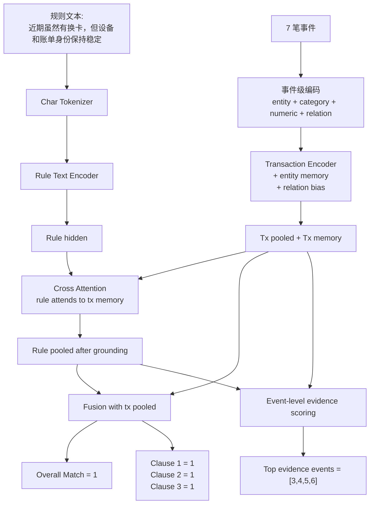

# 文本规则验证器 Case Walkthrough

## 1. 目的

本文档用一条具体的 synthetic verifier 样本，逐步讲清楚：

1. 一条文本规则样本长什么样
2. 它是如何被转换成模型输入的
3. 模型前向时每一层在做什么
4. `evidence_event_indices` 是怎么来的
5. 为什么这条样本会被判定为 match

这份文档和 [text_rule_verifier_architecture_zh.md](/Users/tanxiao/Desktop/Codes/payment_foundation_model/docs/text_rule_verifier_architecture_zh.md) 配合阅读。

---

## 2. 选取的示例样本

这条样本来自当前 synthetic generator，属于：

- `pattern_subtype = benign_shared_device`
- `rule_id = rule_benign_card_refresh`
- `overall_match = 1`

规则文本是：

- `近期虽然有换卡，但设备和账单身份保持稳定`

对应 clause 有 3 个：

1. `recent_multi_card_3d_ge_2`
   - 最近 3 天出现过多张卡

2. `stable_device_recent`
   - 近期设备保持稳定

3. `stable_billing_recent`
   - 近期账单身份保持稳定

这条样本的标签：

- `overall_match = 1`
- `clause_labels = {1, 1, 1}`
- `evidence_event_indices = [3, 4, 5, 6]`

---

## 3. 原始事件时间线

这条样本一共有 7 笔事件，最后一笔是 anchor。

为了便于说明，下面给事件编号：

| idx | 时间 | 卡 | 设备 | 邮箱 | 地址 | 金额 | 类目 |
|---|---|---|---|---|---|---:|---|
| 0 | 2025-07-05 07:18:43 | `card_A` | `device_X` | null | null | 93.13 | beauty |
| 1 | 2025-10-13 07:18:43 | `card_B` | `device_X` | null | null | 57.04 | beauty |
| 2 | 2026-01-21 07:18:43 | `card_A` | `device_X` | `wallet@mail` | `Seattle` | 40.94 | electronics |
| 3 | 2026-03-08 07:18:43 | `card_C` | `device_X` | `wallet@mail` | `Seattle` | 34.51 | daily |
| 4 | 2026-03-21 01:18:43 | `card_C` | `device_X` | `wallet@mail` | `Seattle` | 208.16 | gaming |
| 5 | 2026-03-21 21:18:43 | `card_B` | `device_X` | `wallet@mail` | null | 88.23 | gaming |
| 6 | 2026-03-22 07:18:43 | `card_B` | `device_X` | `wallet@mail` | null | 252.55 | gaming |

说明：

- `card_A/B/C` 是为了讲解方便，对真实 hash 卡号做了抽象
- `device_X` 表示同一台设备
- 第 `6` 笔是 anchor transaction

---

## 4. 先从业务角度看，为什么这条规则会命中

规则是：

- `近期虽然有换卡，但设备和账单身份保持稳定`

人工看这条样本，会得到下面的判断：

### 4.1 最近 3 天确实有换卡

看最近 3 天：

- `idx=4` 使用 `card_C`
- `idx=5` 使用 `card_B`
- `idx=6` 使用 `card_B`

因此：

- 最近 3 天至少出现了两张卡
- `recent_multi_card_3d_ge_2 = 1`

### 4.2 设备稳定

从 `idx=0` 到 `idx=6`：

- 设备始终是 `device_X`

因此：

- `stable_device_recent = 1`

### 4.3 账单身份整体稳定

近一段时间里：

- 邮箱一直是 `wallet@mail`
- 地址在最近两笔变成了 `null`

当前 synthetic 逻辑把“有观测的账单字段整体稳定”视为稳定，因此：

- `stable_billing_recent = 1`

### 4.4 因此 overall_match = 1

三条 clause 都满足，所以：

```text
overall_match = 1
```

这个样本表达的其实是：

- 虽然最近出现了换卡
- 但换卡并没有伴随设备漂移、账单身份漂移
- 更像正常补卡/家庭共享设备带来的 benign 模式

---

## 5. synthetic 标签中的 evidence_event_indices 是怎么来的

当前 synthetic 里不是人工标注 evidence，而是程序化生成。

对这条样本：

- `evidence_event_indices = [3, 4, 5, 6]`

含义是：

- 第 `3, 4, 5, 6` 号事件被当作支持这条规则的候选证据事件

### 5.1 每个 clause 的 evidence

#### Clause 1: `recent_multi_card_3d_ge_2`

synthetic 逻辑会把：

- 最近 3 天窗口内的事件都作为 evidence

这里对应：

- `idx=4, 5, 6`

严格来说，最小证据只需要：

- `idx=4` 的 `card_C`
- `idx=5` 或 `idx=6` 的 `card_B`

但当前实现是宽松版本，所以整个窗口都算。

#### Clause 2: `stable_device_recent`

synthetic 逻辑会把：

- 最近 30 天窗口内的相关事件都作为 evidence

在这条样本里，近 30 天主要包括：

- `idx=3, 4, 5, 6`

#### Clause 3: `stable_billing_recent`

同样会取最近 30 天内能看到账单身份稳定的事件：

- `idx=3, 4, 5, 6`

### 5.2 最终 overall evidence

代码里是把各 clause 的 evidence 做并集：

```text
union(
  evidence(clause_1),
  evidence(clause_2),
  evidence(clause_3)
) = [3, 4, 5, 6]
```

所以这条样本最终存的是：

- `evidence_event_indices = [3, 4, 5, 6]`

---

## 6. 输入到模型前，样本会怎么被编码

在进入模型之前，样本会被拆成两路：

1. 交易上下文
2. 规则文本

### 6.1 交易上下文

7 笔事件会变成 event 序列。

每一笔事件会被编码成：

- 局部实体 ID
- 类别 embedding
- 数值特征
- 与 anchor 的关系特征

例如 `idx=5` 这笔事件，大致会被编码成：

```text
[
  user_local_id = 1,
  card_local_id = 2,
  device_local_id = 1,
  email_local_id = 1,
  address_local_id = 0 or 1,
  ip_local_id = 2,
  domain_id,
  card_country_id = US,
  issuer_id = BankOfAmerica,
  item_category_id = gaming,
  amount_log,
  delta_hours_log,
  same_user_as_anchor = 1,
  same_card_as_anchor = 1,
  same_device_as_anchor = 1,
  same_email_as_anchor = 1,
  same_address_as_anchor = 0/1,
  same_ip_as_anchor = 1
]
```

### 6.2 规则文本

规则文本：

- `近期虽然有换卡，但设备和账单身份保持稳定`

会经过当前原型的字符级 tokenizer，得到：

```text
[近, 期, 虽, 然, 有, 换, 卡, 但, 设, 备, 和, 账, 单, 身, 份, 保, 持, 稳, 定]
```

再转成 `rule_input_ids` 和 `rule_attention_mask`。

---

## 7. 模型前向时具体发生了什么

## 7.1 第一步：交易编码

7 个 event token 先进入交易编码器。

如果打开了 `entity memory`，模型还会额外构造：

- `card memories`
- `device memories`
- `email memories`
- `address memories`
- `ip memories`

对这条样本来说，最重要的 memory 大致包括：

- `card_B memory`
- `card_C memory`
- `device_X memory`
- `wallet@mail memory`

此时序列可以理解成：

```text
[CLS]
[event_0]
[event_1]
[event_2]
[event_3]
[event_4]
[event_5]
[event_6]
[user_memory_1]
[card_memory_A]
[card_memory_B]
[card_memory_C]
[device_memory_X]
...
```

然后进入 relation-aware transformer encoder。

---

## 7.2 第二步：文本编码

规则文本 token 进入一个小型 text encoder，得到：

```text
H_rule = [h_近, h_期, h_虽, ..., h_定]
```

再做 pooled，得到一个规则整体向量。

---

## 7.3 第三步：cross attention

规则 token 去 attend 交易 memory。

直觉上：

- “换卡” 这个短语，会更关注 `card_B / card_C` 相关事件
- “设备稳定” 会更关注 `device_X` 相关事件和 device memory
- “账单身份稳定” 会更关注 email/address 相关事件

这一步后，规则表示不再只是文本本身，而是：

- “这条文本在当前交易上下文里的 grounded 表示”

---

## 7.4 第四步：整体匹配输出

模型会把：

- `tx_pooled`
- `rule_pooled`

做融合：

```text
fused = [tx, rule, tx*rule, |tx-rule|]
```

然后输出：

- `match_logit`

在这条样本里，理想情况下应该得到很高的正值，因为：

- 三个 clause 都满足

---

## 7.5 第五步：clause 输出

同一个 `fused` 向量再经过 `clause_head`，输出：

- `recent_multi_card_3d_ge_2`
- `stable_device_recent`
- `stable_billing_recent`

对应的 logit 都应较高。

如果这是一条 hard negative，例如：

- 最近 3 天有换卡
- 但设备也变了

那么预期是：

- clause_1 高
- clause_2 低
- clause_3 可能高
- overall 低

这就是 verifier 和普通风险分类器的关键区别。

---

## 7.6 第六步：evidence 输出

模型还会对每个 event token 给一个 evidence score。

理想情况下，这条样本中被打高分的应该是：

- `idx=3, 4, 5, 6`

因为它们和 synthetic 的 `evidence_event_indices` 一致。

尤其：

- `idx=4, 5, 6` 对“近 3 天换卡”最关键
- `idx=3, 4, 5, 6` 对“近期设备稳定/账单稳定”也有帮助

---

## 8. 用示意图串起来



---

## 9. 为什么这条样本很适合做 walkthrough

这条样本有几个好处：

1. 它不是单 clause，而是 3 个 clause 的组合
2. 它是一个 positive，但不是明显攻击，而是 benign look-alike
3. 它能体现 verifier 的核心能力：
   - 有换卡
   - 但没有身份漂移
   - 因此不是简单的“看到换卡就判风险”

这比纯粹的 `rule_recent_card_switch` 更能说明问题。

---

## 10. 这条样本也暴露了当前实现的限制

### 10.1 Evidence 还是 overall 并集

当前只存：

- `[3, 4, 5, 6]`

但没有存：

- clause_1 对应哪些 event
- clause_2 对应哪些 event
- clause_3 对应哪些 event

### 10.2 Evidence 不是最小 witness

例如：

- 对“近 3 天换卡”来说，`idx=4` 和 `idx=5` 已经足够

但当前实现把更多 event 一起贴进去。

### 10.3 Billing stability 在 synthetic 里还是简化逻辑

真实业务里：

- “地址为空”
- “有字段缺失”

这些都需要更严格地区分：

- 采集缺失
- 真正变化
- 不可观测

当前 synthetic 只是为了先把 verifier 训练链路跑通。

---

## 11. 总结

这条 case 的关键点可以压缩成一句话：

- **模型不是在判断“这笔交易危险不危险”，而是在判断“这笔交易上下文是否满足这条文本规则”**。

在这个例子里：

1. 最近 3 天确实有换卡
2. 设备稳定
3. 账单身份整体稳定
4. 所以匹配的是一条 benign card refresh / shared-device 风格的规则

如果后续继续完善，这类 walkthrough 最值得补的两步是：

1. 把 clause-level evidence 单独展示出来
2. 把同一条规则的 positive / hard negative 放在一起对比展示
